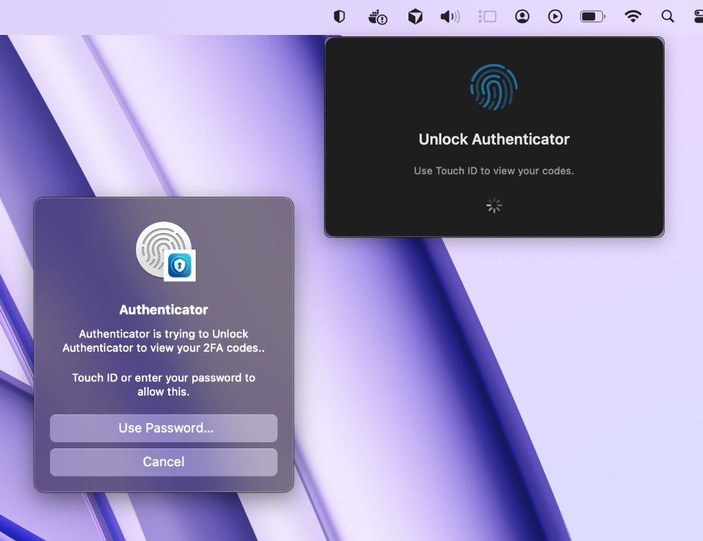
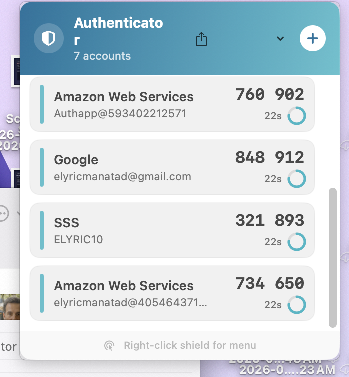
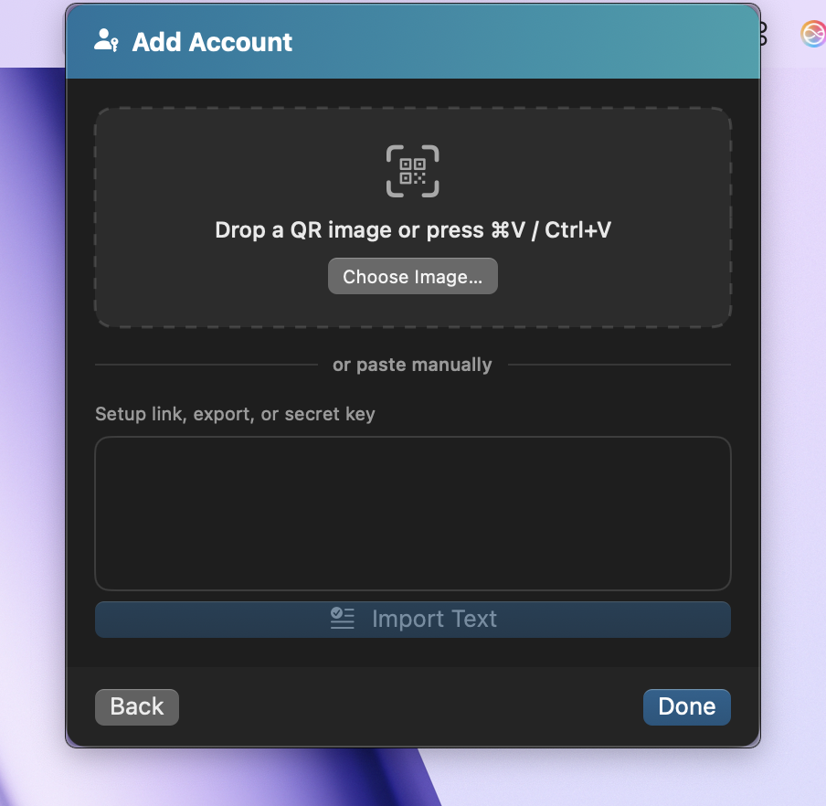

# MacAuthenticator

**Your 2FA codes. One click away. Zero cloud.**

MacAuthenticator is a fast, native macOS menu bar app for TOTP two-factor authentication — built with SwiftUI, locked behind Touch ID, and designed to stay on your Mac and nowhere else.

No subscriptions. No sync servers. No "trust us with your secrets." Just codes when you need them.


<p align="center">
  
</p>

---

## Screenshots

<p align="center">
  
</p>

<p align="center">
  
  &nbsp;&nbsp;
</p>

<p align="center">
  
</p>

<p align="center">
  <em>Touch ID gated · Live codes at a glance · Import & export on your terms</em>
</p>

---

## Why MacAuthenticator?

| | MacAuthenticator | Typical cloud authenticator |
|---|---|---|
| **Stays on your Mac** | Yes | Often syncs to vendor servers |
| **Works offline** | Always | Usually |
| **Touch ID gate** | Built in | Rare on desktop |
| **Menu bar native** | One click | Browser tab or phone app |
| **Open source** | You can read every line | Closed box |
| **Network access** | None | Varies |

Built for people who want **Google Authenticator–grade utility** without handing their secrets to another platform.

---

## Features

### Instant codes from the menu bar

- Live **TOTP codes** with synced **countdown rings**
- **Tap to copy** any code in one click
- Clean card UI — issuer, account name, timer, all in one glance
- Lives in the menu bar — no Dock icon, no noise

### Import however you want

- **Drag & drop** a QR screenshot
- **⌘V / Ctrl+V** paste a copied QR image
- Paste **`otpauth://`** setup links
- Import **Google Authenticator migration** QRs (multiple accounts at once)
- Paste a raw **Base32 secret** when there's no QR

### Export & own your backups

- Export a **single account** as a QR PNG
- Export **all accounts** as one Google-style migration QR
- Export **separate QR images** into a timestamped folder

Your keys. Your backups. Your Mac.

### Security that actually feels secure

- **Touch ID / Face ID** required before codes appear
- Auto-**locks** when you close the panel
- Secrets in **macOS Keychain** + local encrypted backup
- **Sandboxed app with zero network access**

### Polished macOS UX

- Right-click the shield → **Manage 2FA** or **Quit**
- Right-click any account → copy, export, or remove
- Add-account flow with image paste, file picker, and text import

---

## Get started in 60 seconds

### Option A — Download a release

1. Grab `MacAuthenticator.zip` from [Releases](https://github.com/elyric10-dev/mac_authenticator/releases)
2. Drag **MacAuthenticator.app** to **Applications**
3. Open it — click the **shield** in your menu bar
4. Scan your fingerprint. Done.

### Option B — Build it yourself

```bash
git clone https://github.com/elyric10-dev/mac_authenticator.git
cd mac_authenticator
brew install xcodegen    # one-time
xcodegen generate
open MacAuthenticator.xcodeproj
```

Hit **⌘R** in Xcode. Look for the shield in the menu bar.

### One-command install (from source)

```bash
chmod +x scripts/install-and-package.sh
./scripts/install-and-package.sh
```

Installs to `/Applications/MacAuthenticator.app` and creates `dist/MacAuthenticator.zip`.

---

## Requirements

- **macOS 13.0+** (Ventura or later)
- **Xcode 15+** to build from source
- **XcodeGen** (`brew install xcodegen`) if regenerating the project
- Touch ID / Face ID optional (falls back to Mac login password)

---

## How to use

### Menu bar controls

| Action | What happens |
|--------|----------------|
| **Left-click** shield | Open / close the panel |
| **Right-click** shield | Manage 2FA · Quit |

Opening the panel triggers **Touch ID** (or password). Codes stay hidden until you unlock.

### Add an account

1. Click **+**
2. Import via QR image, pasted link, or secret key
3. Codes start generating immediately

**Pro tip:** Screenshot a QR code from any 2FA setup page and **⌘V** it straight into the app.

### Copy, export, remove

- **Copy** — click any account row
- **Export QR** — right-click a row, or use **↑** in the header for bulk export
- **Remove** — right-click → Remove Account

---

## Build & develop

<details>
<summary><strong>Full build steps</strong></summary>

### 1. Clone

```bash
git clone https://github.com/elyric10-dev/mac_authenticator.git
cd mac_authenticator
```

### 2. Generate Xcode project

```bash
xcodegen generate
```

### 3. Run in Xcode

```bash
open MacAuthenticator.xcodeproj
```

### 4. Build + install + zip

```bash
./scripts/install-and-package.sh
```

| Output | Location |
|--------|----------|
| App | `/Applications/MacAuthenticator.app` |
| Zip | `dist/MacAuthenticator.zip` |

Custom install path:

```bash
INSTALL_DIR=~/Applications ./scripts/install-and-package.sh
```

### 5. Regenerate app icons

```bash
./scripts/generate-app-icons.sh
```

Uses `MacAuthenticatorLogo.png` at the project root.

</details>

---

## Project structure

```
MacAuthenticator/
├── MacAuthenticatorLogo.png
├── project.yml
├── docs/screenshots/          # README screenshots
├── scripts/
│   ├── install-and-package.sh
│   └── generate-app-icons.sh
└── MacAuthenticator/
    ├── Models/                  # OTPAccount
    ├── Services/                # TOTP, import/export, Keychain, biometrics
    └── Views/                   # SwiftUI UI
```

<details>
<summary><strong>Full file tree</strong></summary>

```
MacAuthenticator/
├── MacAuthenticatorApp.swift
├── Models/OTPAccount.swift
├── Services/
│   ├── TOTPGenerator.swift
│   ├── OTPImporter.swift / OTPAuthURIParser.swift / OTPAuthURIBuilder.swift
│   ├── GoogleMigrationParser.swift / GoogleMigrationExporter.swift
│   ├── QRImageDecoder.swift / QRCodeGenerator.swift
│   ├── SecretStorage.swift / AccountStore.swift / AccountExporter.swift
│   ├── BiometricAuthService.swift / AppController.swift
│   ├── StatusBarMenuController.swift / TickingClock.swift
│   └── Base32.swift / PasteboardImage.swift
└── Views/
    ├── MenuBarContentView.swift / AccountRow.swift
    ├── AddAccountView.swift / UnlockView.swift
    ├── CountdownRing.swift / AppTheme.swift
```

</details>

---

## Security

| What | Where |
|------|--------|
| Account labels (issuer, email) | Local JSON in Application Support |
| TOTP secrets | macOS Keychain + local backup |
| Network | **Disabled** |

Exported QR images contain secret keys — treat them like passwords.

---

## Troubleshooting

<details>
<summary><strong>App won't open?</strong></summary>

Right-click **MacAuthenticator.app** → **Open**, or run:

```bash
xattr -cr /Applications/MacAuthenticator.app
```

</details>

<details>
<summary><strong>Codes show as dashes?</strong></summary>

Secrets were lost after a reinstall. Re-import from your original QR codes or a backup export.

</details>

<details>
<summary><strong>Touch ID keeps asking?</strong></summary>

Re-import your accounts. If needed, clear old `com.macauthenticator.totp-secrets` entries in **Keychain Access**.

</details>

<details>
<summary><strong>`xcodebuild` not found?</strong></summary>

Install Xcode from the App Store, then:

```bash
sudo xcode-select -s /Applications/Xcode.app/Contents/Developer
```

</details>

---

## Roadmap

- [ ] iCloud sync (maybe — local-first will always be the default)
- [ ] HOTP / counter-based tokens
- [ ] Custom menu bar icon template

**Got ideas?** [Open an issue](https://github.com/elyric10-dev/mac_authenticator/issues) or send a PR.

---

## Contributing

Fork it. Build it. Break it. Fix it. PR it.

1. Fork the repo
2. `git checkout -b feature/cool-thing`
3. Commit + push
4. Open a Pull Request

Keep diffs focused. Match the existing Swift style.

---

## License

MIT — see [LICENSE](LICENSE).

---

## Credits

Built with Swift, CryptoKit, Vision, and LocalAuthentication — no bloat, no BS.

- TOTP: [RFC 6238](https://www.rfc-editor.org/rfc/rfc6238) / [RFC 4226](https://www.rfc-editor.org/rfc/rfc4226)
- Project scaffolding: [XcodeGen](https://github.com/yonaskolb/XcodeGen)

---

<p align="center">
  <strong>Star the repo if MacAuthenticator saves you from digging for your phone.</strong><br>
  <sub>Made with care for the Mac. Yours to inspect, fork, and improve.</sub>
</p>
